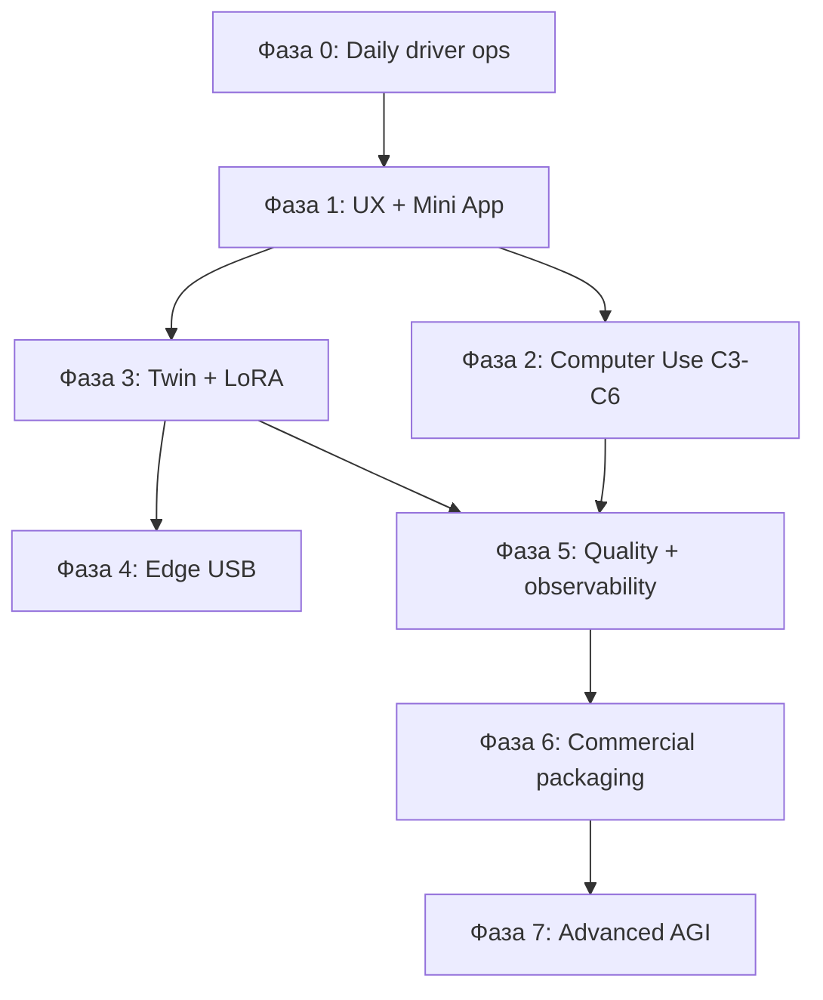

# JARVIS — Product Roadmap (AIO self-hosted personal AGI)

> **Версія:** 1.0 (2026-06-04)  
> **Статус:** Living document — оновлюється з прогресом.  
> **Скоуп:** комерційна якість для **personal use**, повністю self-hosted.

**Пов’язані документи**

| Документ | Роль |
|----------|------|
| [`ROADMAP.md`](../ROADMAP.md) | Короткий ops-backlog (M1–M4, N*, E*, S1) |
| [`docs/DESIGN.md`](DESIGN.md) | Цільова архітектура PortableAI (Edge + Twin + LoRA) |
| [`docs/GAP_ANALYSIS.md`](GAP_ANALYSIS.md) | Що вже є vs що будувати |
| [`docs/COMPUTER_USE.md`](COMPUTER_USE.md) | Computer Use C0–C6 |
| [`docs/ENV_CHECKLIST.md`](ENV_CHECKLIST.md) | Операційний чеклист `.env` |
| [`docs/SMOKE_TEST.md`](SMOKE_TEST.md) | Регресійний smoke |
| [`docs/PLATFORM_ROADMAP.md`](PLATFORM_ROADMAP.md) | Веб-консоль `/platform` + 13 агентних можливостей (P0–P12) |

---

## 1. Позиціонування продукту

### 1.1 Обіцянка

**JARVIS** — один суверенний асистент: Telegram-чат, довготривала памʼять (RAG),
голос (STT/TTS), нагадування, керування Windows-хостом, генерація зображень — без
зовнішніх LLM API для inference.

### 1.2 Диференціатори

- Ollama на хості з **Vulkan** (AMD RDNA1+), не в Docker на Windows
- **Long polling** — бот без публічного URL для ingest
- **Computer Use** з підтвердженням у Telegram і аудитом
- Шлях **PortableAI**: Twin (поточний стек) → Edge (USB) → персональна LoRA

### 1.3 Чесні обмеження

| Теза | Реальність |
|------|------------|
| «Як GPT-4» | Ні — компенсація: privacy, $0 inference, повний контроль |
| «AGI» | Ні — ReAct-агент + інструменти + (опц.) fine-tune |
| «Privacy абсолютна» | Inference — так; **training** — ephemeral RunPod (ADR-007) |
| QLoRA локально на RX 5700 XT | Ні — лише cloud-burst або окрема NVIDIA |

### 1.4 North Star (12 місяців)

> Після ребуту Windows через ~2 хвилини пишу в Telegram — JARVIS памʼятає контекст,
> може скріншот/PS/макрос, стрімить відповідь; раз на місяць підтягує нову LoRA з Twin.

---

## 2. Baseline (стан на 2026-06-04)

### 2.1 Готово

- [x] Microservices: gateway, tools, memory, whisper, tts, postgres, redis
- [x] Ollama на хості (Vulkan + keep_alive), фази 1–7 + polish (mypy, CI)
- [x] Агент-луп, hybrid routing, streaming (`editMessageText`)
- [x] RAG (pgvector), STT, TTS (piper), embedding cache
- [x] Notes, reminders (Redis ZSET + gateway poller)
- [x] Multi-user whitelist + `/allow` + per-user isolation
- [x] Telegram Mini App (`/app`), initData HMAC
- [x] Twin: ModelRegistry, SessionLogger, Sync API (`twin/`)
- [x] Computer Use **C0–C2** (host-agent, T0/T1, confirm + audit)
- [x] Post-audit: streaming parity, `agent_turn`, origin confirm, `/start canvas`

### 2.2 WIP (незакомічено / в роботі)

- [x] `health_watch` — проактивні алерти в Telegram (+ тести)
- [x] `remote` — `/file`, `/macro`, `/tasks`, `/see` (+ тести)
- [x] `jobs` + `macros` — cron-макроси без LLM (+ тести)
- [ ] `jarvis_core` facade + pipeline
- [ ] SD Forge / `image_gen` (локальна генерація)
- [x] `browser.py` — Playwright C3 (+ тести)

### 2.3 Свідомо не робимо

Див. [`ROADMAP.md` § «Що НЕ робити`](../ROADMAP.md): зміна embed dim без міграції,
`ENABLE_CODE_EXEC` без sandbox, Ollama-in-Docker на AMD Windows, n8n як оркестратор,
передчасний Celery/FastStream.

---

## 3. Фази продукту

---

## Фаза 0 — «Можна жити щодня» (1–2 тижні)

**Мета:** стабільність після ребуту, безпека, один сценарій «все підняти».

### 0.1 Операційний контур

| # | Задача | DoD | Статус |
|---|--------|-----|--------|
| 0.1.1 | **M4** — ротація `TELEGRAM_BOT_TOKEN` (інцидент у логах) | Новий токен у `.env`, старий revoked | [x] |
| 0.1.2 | Єдиний autostart: `scripts/autostart.ps1` + `verify_stack.ps1` | Ребут → smoke < 5 хв | [x] |
| 0.1.3 | Пройти [`ENV_CHECKLIST.md`](ENV_CHECKLIST.md); `WEBAPP_DEV_OPEN=false` у проді | Немає витоку токенів у логах | [x] `verify_stack -StrictProd` |
| 0.1.4 | Бекапи: `data/`, postgres volume, `data/twin/`, `computer.jsonl` | Runbook відновлення | [x] [`BACKUP.md`](BACKUP.md) |

### 0.2 Закрити WIP

| # | Задача | Статус |
|---|--------|--------|
| 0.2.1 | Стабілізувати `health_watch` + тести | [x] |
| 0.2.2 | Стабілізувати `remote` + `macros` + `jobs` | [x] |
| 0.2.3 | `agent_turn` — єдиний turn-path, паритет stream/deliver | [x] |
| 0.2.4 | CI green на нових модулях | [x] pytest gateway/tools (нові тести) |

### 0.3 Smoke як продукт

| # | Задача | Статус |
|---|--------|--------|
| 0.3.1 | Розширити [`SMOKE_TEST.md`](SMOKE_TEST.md) до щоденного чеклиста (15+ пунктів) | [x] |
| 0.3.2 | 2 тижні щоденного використання без ручного Ollama/Docker | [ ] |

**Вихід фази 0:** daily driver без сюрпризів після ребуту.

---

## Фаза 1 — UX «як комерційний асистент» (2–4 тижні)

**Мета:** відчуття «як ChatGPT», довіра, зрозумілий онбординг.

### 1.1 Діалог і контекст

| # | Задача | Статус |
|---|--------|--------|
| 1.1.1 | Персональний профіль у промпті / memory (стиль, мова, табу) | [x] `data/profiles/{id}.json` |
| 1.1.2 | Summarization довгих тредів перед RAG (DESIGN §4.8) | [x] thread context (12 msgs) |
| 1.1.3 | Стабільний шлях файлів/фото → `parse_file` / `ocr_image` у hybrid | [x] `_FILE_RE` → agent |
| 1.1.4 | Голос E2E: STT → agent → TTS за замовч.; toggle у Mini App | [x] runtime flag + checkbox |

### 1.2 Mini App — центр керування

| # | Задача | Статус |
|---|--------|--------|
| 1.2.1 | Статус: Ollama, моделі, host-agent, Docker, останні помилки | [x] vision + image_gen cards |
| 1.2.2 | Перемикачі: `AGENT_MODE`, streaming, voice reply | [x] `/app/flags` |
| 1.2.3 | Read-only: останні N сесій з postgres | [x] `/app/sessions` |
| 1.2.4 | Named tunnel **лише для `/app`** (опц.); бот лишається на polling | [ ] |

### 1.3 Інструменти (без Computer)

| # | Задача | Статус |
|---|--------|--------|
| 1.3.1 | Покращений `web_fetch` (таймаути, readability) | [x] article/main, content-type |
| 1.3.2 | Експорт нагадувань / ICS (опц.) | [x] `/reminders ics` |
| 1.3.3 | `code_exec` — лишати вимкненим до sandbox | [x] default off |

### 1.4 Мультимодальність (локально)

| # | Задача | Статус |
|---|--------|--------|
| 1.4.1 | SD Forge: `setup_sd_forge.ps1`, `start_sd_forge.ps1`, `IMAGE_GEN_URL` | [x] [`IMAGE_GEN.md`](IMAGE_GEN.md) |
| 1.4.2 | Horde/pollinations — лише явний opt-in | [x] `.env.example` |
| 1.4.3 | VRAM policy: image gen не вбиває agent model (черга / «зайнято») | [x] `image_gen_lock` |

**Вихід фази 1:** ви + 1–2 друзі (E3) користуєтесь без README.

---

## Фаза 2 — Computer Use «продуктовий» (4–8 тижнів)

**База:** [`COMPUTER_USE.md`](COMPUTER_USE.md) — C0–C2 ✅.

### 2.1 C3 — Браузер (T2) — найвищий ROI

| Крок | Задача | DoD | Статус |
|------|--------|-----|--------|
| C3.1 | Playwright у tools + `browser_*` у toolkit | Інструменти в agent loop | [x] |
| C3.2 | ADR: Chrome profile (чистий vs logged-in) | [`docs/adr/C3-browser-profile.md`](adr/C3-browser-profile.md) | [x] |
| C3.3 | Confirm для mutating browser actions | Inline ✅/❌ | [x] |
| C3.4 | Smoke: URL → заголовок/текст у Telegram | E2E pass | [x] API smoke у `verify_stack` + [`smoke_c3_browser.ps1`](../scripts/smoke_c3_browser.ps1); [ ] live TG |

### 2.2 C4 — UI Automation (T3)

| Крок | Задача | Статус |
|------|--------|--------|
| C4.1 | host-agent: `/uia/*`, `/window/*` | [x] |
| C4.2 | Toolkit: `uia_invoke`, `window_focus` | [x] |
| C4.3 | UX для `computer_learned` (довірені cmdlet/exe) | [x] Mini App + `/computer/learned` |

### 2.3 C5 — Admin (обмежено)

| Крок | Задача | Статус |
|------|--------|--------|
| C5.1 | `COMPUTER_ALLOW_ADMIN` лише `ADMIN_USER_IDS` | [x] |
| C5.2 | Подвійне підтвердження + audit tier `admin` | [x] `cmpA:Y` |
| C5.3 | Runbook відкату шкоди | [x] [`COMPUTER_ROLLBACK.md`](COMPUTER_ROLLBACK.md) |

### 2.4 C6 — Vision (T4) — опційно

| Крок | Задача | Статус |
|------|--------|--------|
| C6.1 | On-demand vision model / unload 7B | [x] `OLLAMA_VISION_ON_DEMAND` + `ollama_vram.py` |
| C6.2 | `screen_click` з координат — останній резерв | [x] host-agent `/screen/click` |

### 2.5 Trust model

| # | Задача | Статус |
|---|--------|--------|
| 2.5.1 | Owner vs guest для computer (`computer_access.py`) | [x] |
| 2.5.2 | Макроси без LLM — safe path для рутини | [x] `/macro run`, Mini App ⚡ |
| 2.5.3 | Rate limit computer actions / годину | [x] `COMPUTER_RATE_LIMIT_PER_HOUR` |
| 2.5.4 | Mini App: tail `computer.jsonl` | [x] audit у `/app/remote` |

**Вихід фази 2:** ≥80% Windows-задач через PS/CLI/браузер без піксельного кліку.

---

## Фаза 3 — PortableAI Twin: «свій мозок» (2–3 місяці)

**Gap:** [`GAP_ANALYSIS.md`](GAP_ANALYSIS.md) — поточний стек ≈ Twin HQ.

### 3.1 Етап A — Twin-ізація

| # | Компонент | Статус | Далі |
|---|-----------|--------|------|
| A.1 | ModelRegistry (`twin/app/registry.py`) | [x] є | [x] Mini App promote/rollback |
| A.2 | SessionLogger JSONL | [x] є | [x] `session_ingest` → `data/logs/sessions/` + Twin |
| A.3 | Sync API | [x] є | [x] [`dataset_export`](../tools/app/dataset_export.py) + `export_dataset.ps1` |
| A.4 | n8n → legacy, не default | [x] | [x] [`N8N_LEGACY.md`](N8N_LEGACY.md) |

### 3.2 Етап C — Дані (critical path)

| Крок | Задача | Обсяг | Статус |
|------|--------|-------|--------|
| C.1 | SessionLogger → курація найкращих діалогів | ручний + фільтри | [x] фільтри в `dataset_export` |
| C.2 | ShareGPT JSONL | 500 train / 50 holdout | [x] train/holdout split |
| C.3 | Eval harness (format + LLM-as-judge) | локально | [x] скелет [`training/eval/run_eval.py`](../training/eval/run_eval.py) |
| C.4 | Correctness gate перед promote LoRA | smoke + eval ↑ | [x] `gate.py` + `TWIN_MIN_EVAL_PROMOTE` |

### 3.3 Етап D — Training (cloud-burst, ADR-007)

| Крок | Задача | Статус |
|------|--------|--------|
| D.1 | `training/` — RunPod + Unsloth скрипт | [x] skeleton [`train_unsloth.py`](../training/runpod/train_unsloth.py) |
| D.2 | LoRA → registry → Blue-Green symlink | [x] `link_active_lora.ps1` |
| D.3 | Ollama Modelfile / adapter load | [x] `training/ollama/Modelfile.lora.template` |
| D.4 | Scheduler: retrain кожні +200 якісних прикладів | [x] `train_scheduler` + `TRAIN_RETRAIN_MIN_CURATED` |

### 3.4 Архітектура коду

| # | Задача | Статус |
|---|--------|--------|
| 3.4.1 | `jarvis_core` — gateway/tools = транспорт, логіка в facade | [x] JARVIS facade + pipeline |
| 3.4.2 | `OllamaAdapter` + майбутній `KoboldAdapter` | [x] Ollama; [ ] Kobold |
| 3.4.3 | Cascade routing (classify → chat/agent/computer) | [x] `jarvis_core.routing.cascade` |

**Вихід фази 3:** перша LoRA з eval, rollback за 1 команду.

---

## Фаза 4 — Edge MVP (USB) (1–2 місяці після 3.2) · **активна (~70%)**

DESIGN Phase 1–3.

| # | Задача | Статус |
|---|--------|--------|
| 4.1 | KoboldCPP + Qwen 7B Q4 на USB layout | [x] layout + `run_win.bat` / `run_linux.sh` |
| 4.2 | `KoboldAdapter` — той самий agent loop | [x] `jarvis_core` + `LLM_BACKEND=kobold` у tools |
| 4.3 | SQLite-vec RAG на Edge | [x] `edge/rag.py` |
| 4.4 | SyncAgent: OFFLINE / LAN / VPN | [x] `edge/edge_sync.py` + `GET /registry/lora/active/download` |
| 4.5 | `run_win.bat` / `run_linux.sh` one-click | [x] |

**Вихід фази 4:** флешка офлайн → LAN → проксі на Twin; LoRA sync автоматичний.

> Деталі та поточний % — `docs/PLATFORM_ROADMAP.md` → "Фаза 4 — Edge USB"
> (тут і там — той самий перелік 4.1–4.5; тримайте чекбокси в синхроні).

---

## Фаза 5 — Якість і observability (паралельно 3–4)

| # | Напрям | Задачі | Статус |
|---|--------|--------|--------|
| 5.1 | Тести | Contract host-agent ↔ tools; golden traces | [x] contract + `tools/tests/golden/` |
| 5.2 | Логи | structlog JSON; `request_id` gateway→tools | [x] `X-Request-ID` middleware |
| 5.3 | Метрики | tok/s, tool latency, RAG hit → Mini App | [x] turn/tool/RAG у `/dashboard`; [ ] tok/s |
| 5.4 | S1 черга | Redis queue + workers — лише при навантаженні | [ ] |
| 5.5 | Threat model | computer, web_fetch, uploads | [x] [`THREAT_MODEL.md`](THREAT_MODEL.md) |
| 5.6 | Міграції БД | Alembic; версіонування embed dim | [ ] |

---

## Фаза 6 — Комерційна упаковка

| # | Артефакт | Статус |
|---|----------|--------|
| 6.1 | `Install-JARVIS.ps1` (Docker, Ollama, models, host-agent) | [x] skeleton [`scripts/Install-JARVIS.ps1`](../scripts/Install-JARVIS.ps1) |
| 6.2 | Ліцензія + EULA (computer disclaimer) | [ ] |
| 6.3 | Quick Start 10 хв + Troubleshooting AMD Vulkan | [ ] |
| 6.4 | Edition matrix: Core / Pro (+computer) / Studio (+training) | [ ] |
| 6.5 | Semver, CHANGELOG, оновлення compose | [ ] |
| 6.6 | Positioning: self-hosted only (без обовʼязкового SaaS) | [ ] |

---

## Фаза 7 — Advanced (6+ місяців, лише з use case)

| # | Фіча | Умова старту | Статус |
|---|------|----------------|--------|
| 7.1 | Multi-agent (Orchestrator + Critic) | Eval pipeline | [ ] |
| 7.2 | Self-improving loop (авто-датасет) | Human review gate | [ ] |
| 7.3 | Domain LoRA swap (MoE-стиль) | 2+ LoRA в registry | [ ] |
| 7.4 | llama.cpp benchmark (ROADMAP E1) | Bottleneck підтверджений | [ ] |
| 7.5 | WireGuard замість cloudflared | Потрібен віддалений Edge | [ ] |

---

## 4. Пріоритетна черга (наступні кроки)

### Тиждень 1–2

1. [x] M4 — rotate Telegram token  
2. [x] `autostart.ps1` + `verify_stack.ps1` на ребуті  
3. [ ] Стабілізувати health_watch, remote, macros, jobs  
4. [ ] Smoke після кожної зміни `.env`

### Тиждень 3–4

5. [ ] Mini App: режими + health + computer log  
6. [ ] SD Forge stable path  
7. [ ] Перші 50 кураційних прикладів → ShareGPT

### Місяць 2

8. [ ] C3 Playwright E2E  
9. [ ] Eval harness + holdout  
10. [ ] RunPod — перший QLoRA experiment  

### Місяць 3

11. [ ] Promote/rollback LoRA в Ollama  
12. [ ] Edge KoboldCPP (якщо потрібна USB)

---

## 5. KPI (щомісячний огляд)

| KPI | Ціль |
|-----|------|
| Uptime після ребуту | 100% без ручних кроків |
| P95 відповіді (chat, warm model) | < 8 с |
| P95 agent + 1 tool | < 25 с |
| Computer success (whitelist tasks) | > 90% |
| Eval після LoRA | ↑ vs baseline, без smoke-регресії |
| Security incidents | 0 неавторизованих computer/admin |

---

## 6. Edition matrix (цільова)

| Edition | Включено |
|---------|----------|
| **Core** | Chat, RAG, STT, streaming, Mini App, multi-user |
| **Pro** | + Computer Use C0–C5, macros, health_watch, image gen local |
| **Studio** | + Twin training sync, LoRA deploy, Edge USB, eval dashboard |

---

## 7. Історія оновлень документа

| Дата | Зміна |
|------|-------|
| 2026-06-04 | v1.0 — початкова версія з baseline + фази 0–7 |

---

*JARVIS Product Roadmap — оновлюйте чекбокси при закритті задач; ops-деталі — у [`ROADMAP.md`](../ROADMAP.md).*
