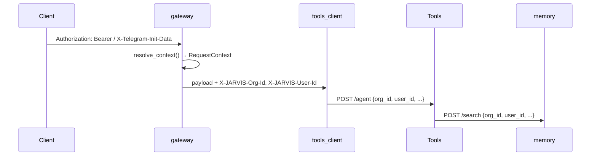

# JARVIS → SaaS: Deep Dive (Implementation Blueprint)

> **Версія:** 1.1 (2026-06-08, оновлено після комітів P0–P12)  
> **Статус:** Technical spec — для імплементації фаз S0–S3  
> **Базується на:** аудит репозиторію `O:/JARVIS`, `THREAT_MODEL.md`, `PRODUCT_ROADMAP.md`  
> **Останній baseline:** `07efc8f` (Platform P0–P12), `f24c14f` (тести), `jarvis_core` wired

Цей документ — **найглибший рівень деталізації**: точні таблиці, файли, Redis-ключі, API-контракти,
послідовність PR, тести.

> **Місце в ієрархії:** це **impl-enabler** (tenant/identity/keys/billing) під продуктовими треками
> [`API_PLATFORM_ROADMAP.md`](API_PLATFORM_ROADMAP.md) (Стовп A) і [`CLIENTS_ROADMAP.md`](CLIENTS_ROADMAP.md) (Стовп C, JWT-auth).
> Стратегічний огляд — [`PRODUCT_ROADMAP.md`](PRODUCT_ROADMAP.md); принципи (S2: self-hosted не ламається) — [`AGENTS.md`](../AGENTS.md).
> PR#0 (IDOR) і PR#1 (RequestContext) тут — спільний блокер для AP-1 і CL-1.

---

## 0. Що змінилось у репо (delta v1.0 → v1.1)

### 0.1 Закрито з моменту першого аудиту

| Зміна | Коміт / файл | Вплив на SaaS |
|-------|--------------|---------------|
| **Platform P0–P12** — API + UI | `07efc8f`, `gateway/app/platform/*` | SaaS UI reuse готовий на ~90% |
| **proxy.py** — єдиний шар для list/get/spawn | `gateway/app/platform/proxy.py` | **1 файл** для tenant propagation замість 18 |
| **tools routes refactor** — `mount_routes()` | `tools/app/routes/__init__.py` | Middleware tenant context в одному місці |
| **jarvis_core** — shared package | `jarvis_core/bg_jobs.py`, `auth_ids.py`, `facade/` | Дом для `RequestContext`, не новий пакет |
| **JOB_TYPES** централізовано | `jarvis_core/bg_jobs.py` | 6 типів jobs; Platform `jobs.py` вже імпортує `platform_create_method` |
| **guard-dedup** — `require_text`, `require_found`, `require_mode` | `gateway/app/_helpers.py`, `tools/app/routes/_helpers.py` | Патерн готовий; винести в `jarvis_core` |
| **tools_client_http** | `gateway/app/tools_client_http.py` | Точка для `X-JARVIS-Org-Id` headers |
| **X-Request-ID** end-to-end | `gateway/app/request_id.py`, `tools/app/main.py` middleware | Патерн propagation вже є |
| **13 platform test files** | `gateway/tests/test_platform_*.py` | Шаблон для `test_tenant_*.py` |
| **Phase 7.2 Improve UI** | `platform.html` + `platform/improve.py` | Studio-tier feature вже в консолі |
| **platform.html v2** — nav groups, i18n, mobile | ~1433 рядків, `lbl("uk","en")` | SaaS onboarding додавати в групу «System» |

### 0.2 Нові ризики (виявлені після рефакторингу)

| Ризик | Де | Наслідок для multi-tenant |
|-------|-----|---------------------------|
| ~~**get_by_id без ownership**~~ ✅ PR#0 | `proxy.register_tools_get_by_id` → `owner_scoped` | Закрито: ownership-гейт у store + proxy (jobs/plans/teams/orchestrator/subagents; skills — глобальні) |
| ~~**bgjobs_get без user_id**~~ ✅ PR#0 | `tools/app/routes/bgjobs.py::bgjobs_get` | Закрито: обов'язковий `user_id` на всіх GET-by-id |
| ~~**Дубль helpers gateway↔tools**~~ ✅ PR#1 | `_helpers.py` в обох сервісах | Закрито: `jarvis_core/http_helpers.py` + re-export (дефолти `field` збережено) |
| **Orchestrator без UI** | API `platform/orchestrator.py` є, табу в `platform.html` немає | Studio tier неповний в консолі |
| **Глобальна черга bg jobs** | `jarvis:bgjob:queue` | Worker обробляє jobs усіх org без ізоляції |
| **metrics глобальні** | `tools/app/metrics.py` | Billing metering не per-org |

### 0.3 Оновлена стратегія (коротко)

1. **Не чіпати 18 platform-модулів поодинці** — розширити `proxy.py` + `platform/auth.py` один раз.
2. **Не чіпати 20 tools route-модулів поодинці** — middleware в `tools/app/main.py` + ContextVar.
3. **Дом для tenant-логіки — `jarvis_core/`** (поруч із `bg_jobs.py`, `auth_ids.py`).
4. **Закрити IDOR до SaaS** — `get_by_id` має перевіряти `rec["user_id"]` / `org_id` (окремий PR#0).
5. **Self-hosted не ламається** — `SAAS_MODE=false`, synthetic org, Telegram flow без змін.

---

## 1. Поточний стан (аудит 2026-06-08, baseline `07efc8f`)

### 1.1 Identity model

| Концепт | Реалізація | Файл |
|---------|------------|------|
| User ID | Telegram `BIGINT` | `gateway/app/router.py`, усі payloads |
| Admin | `ADMIN_USER_IDS` + `authorize_admin()` | `gateway/app/telegram_webapp_auth.py` |
| Platform auth | Telegram initData **або** HTTP Basic (1 admin) | `gateway/app/platform/auth.py` |
| Access whitelist | `.env ALLOWED_USER_IDS` + dynamic JSON | `gateway/app/access_store.py` |
| OpenAI API | Один глобальний `OPENAI_API_KEY` | `gateway/app/openai_api.py` |

**Висновок:** немає `organization`, `member`, `role`, per-tenant API keys.

### 1.2 Data isolation

| Шар | Скоуп | Проблема для SaaS |
|-----|-------|-------------------|
| Postgres | `user_id BIGINT` | Немає `org_id`; два org можуть мати однаковий telegram_id (теоретично) |
| Redis | `jarvis:*` глобальні | Cross-tenant leak при shared Redis |
| Filesystem | `data/profiles/{user_id}.json` | Немає org prefix |
| Twin/LoRA | `data/twin/` один registry | Один tenant |

### 1.3 Підрахунок `user_id` у коді

| Пакет | Файлів з `user_id` | Критичність |
|-------|-------------------|-------------|
| `gateway/app/` | ~48 файлів | Transport + auth |
| `tools/app/` | ~45 файлів | Agent + stores |
| `memory/app/` | 2 файли (`db.py`, `main.py`) | RAG source of truth |

### 1.4 Redis keys (повний реєстр)

| Ключ / prefix | Файл | Tenant-safe? | SaaS ключ |
|---------------|------|--------------|-----------|
| `rl:{user_id}:{window}` | `gateway/app/ratelimit.py` | ❌ | `jarvis:{org_id}:rl:{user_id}:{window}` |
| `jarvis:project:{user_id}` | `gateway/app/projects.py`, `tools/app/projects.py` | ❌ | `jarvis:{org_id}:project:{user_id}` |
| `jarvis:bgjob:{id}` | `tools/app/bg_jobs.py` | ❌ | `jarvis:{org_id}:bgjob:{id}` |
| `jarvis:bgjob:index:{user_id}` | `tools/app/bg_jobs.py` | ❌ | `jarvis:{org_id}:bgjob:index:{user_id}` |
| `jarvis:bgjob:queue` | `tools/app/bg_jobs.py` | ❌ global queue | `jarvis:{org_id}:bgjob:queue` або shared queue + org у payload |
| `jarvis:plan:{id}` | `tools/app/plans.py` | ❌ | `jarvis:{org_id}:plan:{id}` |
| `jarvis:plan:index:{user_id}` | `tools/app/plans.py` | ❌ | prefix org |
| `jarvis:subagent:*` | `tools/app/subagents.py` | ❌ | prefix org |
| `jarvis:team:*` | `tools/app/teams.py` | ❌ | prefix org |
| `jarvis:orch:*` | `tools/app/orchestrator.py` | ❌ | prefix org |
| `jarvis:skill:{user_id}` | `tools/app/skills.py` | ❌ | prefix org |
| `jarvis:computer:pending:{user_id}` | `tools/app/computer_confirm.py` | ❌ | prefix org |
| `jarvis:computer:origin:{user_id}` | `tools/app/computer_confirm.py` | ❌ | prefix org |
| `jarvis:computer:trust:{user_id}` | `tools/app/computer_trust.py` | ❌ | prefix org |
| `jarvis:computer:rl:{user_id}:{hour}` | `tools/app/computer_rate_limit.py` | ❌ | prefix org |
| `jarvis:tasks:{user_id}` | `tools/app/tasks.py` | ❌ | prefix org |
| `jarvis:jobs` (ZSET) | `tools/app/jobs.py` | ❌ | per-org ZSET |
| `jarvis:flags:streaming` | `gateway/app/runtime_flags.py` | ❌ global | per-org або global ops-only |
| `jarvis:flags:voice` | `gateway/app/runtime_flags.py` | ❌ global | per-org |
| `jarvis:metrics:*` | `tools/app/metrics.py` | ❌ global | per-org + global ops aggregate |
| `jarvis:health:state` | `gateway/app/health_watch.py` | ✅ ops | залишити global |
| `jarvis:image_gen:busy` | `tools/app/image_gen_lock.py` | ❌ | per-org lock |
| `jarvis:admin:pending:*` | `gateway/app/bot/admin.py` | ✅ single admin | N/A SaaS |
| `jarvis:cursor:await:{user_id}` | `gateway/app/bot/cursor_flow.py` | ❌ | prefix org |
| `jarvis:tg:keyboard_*:{user_id}` | `gateway/app/bot/quick_actions.py` | ❌ | prefix org |

**Центральна зміна:** розширити `RedisIndexedStore` (`tools/app/redis_store.py`):

```python
class RedisIndexedStore:
    def __init__(self, *, org_scoped: bool = True, ...):
        self.org_scoped = org_scoped

    def _key(self, doc_id: str, org_id: str | None = None) -> str:
        if self.org_scoped and org_id:
            return f"jarvis:{org_id}:{self._suffix}{doc_id}"
        return f"{self.key_prefix}{doc_id}"
```

---

## 2. Цільова identity & context model

### 2.1 Типи ідентифікаторів

```
org_id     UUID v4     — tenant (організація / workspace)
user_id    UUID v4     — внутрішній користувач (НЕ Telegram)
member_id  composite   — (org_id, user_id) + role
tg_id      BIGINT      — Telegram user id (nullable, linked)
api_key_id UUID        — per-org API key
legacy_uid BIGINT      — старий Telegram id (міграційний міст)
```

**Стратегія міграції:** self-hosted інстанс = один synthetic org `00000000-0000-0000-0000-000000000001`;
існуючі `user_id BIGINT` → `legacy_uid` у таблиці `users`, mapping 1:1.

### 2.2 RequestContext (новий dataclass)

Файл: **`jarvis_core/context.py`** — у тому ж пакеті, що вже містить `bg_jobs.py` (Platform імпортує
звідси `platform_create_method`) та `auth_ids.py` (спільна логіка Computer owners). Gateway і tools
обидва залежать від `jarvis_core` — не створювати третій пакет.

```python
@dataclass(frozen=True)
class RequestContext:
    org_id: str           # UUID string
    user_id: str          # internal UUID
    role: str             # owner|admin|member|viewer
    plan: str             # free|pro|team|studio
    legacy_uid: int | None  # Telegram BIGINT для backward compat
    via: str              # jwt|telegram|api_key|basic
    request_id: str | None = None
```

### 2.3 Propagation через стек



**Нові HTTP headers (internal):**

| Header | Опис |
|--------|------|
| `X-JARVIS-Org-Id` | UUID tenant |
| `X-JARVIS-User-Id` | UUID internal user |
| `X-JARVIS-Role` | RBAC role |
| `X-JARVIS-Plan` | billing plan |
| `X-JARVIS-Legacy-Uid` | Telegram id (optional) |
| `X-Request-ID` | вже є |

---

## 3. Database schema (повна міграція)

### 3.1 Нові таблиці

Файл: `memory/migrations/versions/004_saas_tenant.py`
> **Нумерація:** слот `003` уже зайнятий (`003_context_passports.py`), тож SAAS-міграція — `004`.

```sql
-- === Tenant core ===
CREATE TABLE IF NOT EXISTS organizations (
    id              UUID PRIMARY KEY DEFAULT gen_random_uuid(),
    name            TEXT NOT NULL,
    slug            TEXT NOT NULL UNIQUE,
    plan            TEXT NOT NULL DEFAULT 'free'
                    CHECK (plan IN ('free','pro','team','studio','enterprise')),
    stripe_customer_id TEXT,
    stripe_subscription_id TEXT,
    settings        JSONB NOT NULL DEFAULT '{}'::jsonb,
    created_at      TIMESTAMPTZ NOT NULL DEFAULT now(),
    updated_at      TIMESTAMPTZ NOT NULL DEFAULT now()
);

CREATE TABLE IF NOT EXISTS users (
    id              UUID PRIMARY KEY DEFAULT gen_random_uuid(),
    email           TEXT UNIQUE,
    password_hash   TEXT,
    telegram_id     BIGINT UNIQUE,
    legacy_uid      BIGINT UNIQUE,  -- міграція з поточного user_id
    display_name    TEXT,
    created_at      TIMESTAMPTZ NOT NULL DEFAULT now()
);

CREATE TABLE IF NOT EXISTS members (
    org_id          UUID NOT NULL REFERENCES organizations(id) ON DELETE CASCADE,
    user_id         UUID NOT NULL REFERENCES users(id) ON DELETE CASCADE,
    role            TEXT NOT NULL DEFAULT 'member'
                    CHECK (role IN ('owner','admin','member','viewer')),
    invited_at      TIMESTAMPTZ NOT NULL DEFAULT now(),
    joined_at       TIMESTAMPTZ,
    PRIMARY KEY (org_id, user_id)
);

CREATE TABLE IF NOT EXISTS api_keys (
    id              UUID PRIMARY KEY DEFAULT gen_random_uuid(),
    org_id          UUID NOT NULL REFERENCES organizations(id) ON DELETE CASCADE,
    name            TEXT NOT NULL DEFAULT 'default',
    key_prefix      TEXT NOT NULL,       -- sk-jarvis-abc... (перші 12 chars для lookup)
    key_hash        TEXT NOT NULL,       -- bcrypt
    scopes          TEXT[] NOT NULL DEFAULT ARRAY['chat'],
    last_used_at    TIMESTAMPTZ,
    revoked_at      TIMESTAMPTZ,
    created_at      TIMESTAMPTZ NOT NULL DEFAULT now()
);
CREATE INDEX idx_api_keys_prefix ON api_keys (key_prefix) WHERE revoked_at IS NULL;

CREATE TABLE IF NOT EXISTS usage_events (
    id              BIGSERIAL PRIMARY KEY,
    org_id          UUID NOT NULL,
    user_id         UUID,
    event_type      TEXT NOT NULL,  -- turn|token|job|api_call|embed
    quantity        BIGINT NOT NULL DEFAULT 1,
    meta            JSONB NOT NULL DEFAULT '{}'::jsonb,
    created_at      TIMESTAMPTZ NOT NULL DEFAULT now()
);
CREATE INDEX idx_usage_org_month ON usage_events (org_id, created_at);

CREATE TABLE IF NOT EXISTS audit_log (
    id              BIGSERIAL PRIMARY KEY,
    org_id          UUID NOT NULL,
    actor_user_id   UUID NOT NULL,
    action          TEXT NOT NULL,
    target_type     TEXT,
    target_id       TEXT,
    meta            JSONB NOT NULL DEFAULT '{}'::jsonb,
    created_at      TIMESTAMPTZ NOT NULL DEFAULT now()
);
CREATE INDEX idx_audit_org ON audit_log (org_id, created_at DESC);

CREATE TABLE IF NOT EXISTS org_integrations (
    org_id          UUID NOT NULL REFERENCES organizations(id) ON DELETE CASCADE,
    provider        TEXT NOT NULL,
    access_token_enc TEXT NOT NULL,
    refresh_token_enc TEXT,
    expires_at      TIMESTAMPTZ,
    meta            JSONB NOT NULL DEFAULT '{}'::jsonb,
    updated_at      TIMESTAMPTZ NOT NULL DEFAULT now(),
    PRIMARY KEY (org_id, provider)
);
```

### 3.2 Alter existing tables

```sql
ALTER TABLE sessions    ADD COLUMN IF NOT EXISTS org_id UUID;
ALTER TABLE messages    ADD COLUMN IF NOT EXISTS org_id UUID;
ALTER TABLE embeddings  ADD COLUMN IF NOT EXISTS org_id UUID;
ALTER TABLE projects    ADD COLUMN IF NOT EXISTS org_id UUID;

CREATE INDEX IF NOT EXISTS idx_sessions_org_user ON sessions (org_id, user_id);
CREATE INDEX IF NOT EXISTS idx_messages_org_user ON messages (org_id, user_id, created_at);
CREATE INDEX IF NOT EXISTS idx_embeddings_org_user_project ON embeddings (org_id, user_id, project_id);
CREATE INDEX IF NOT EXISTS idx_projects_org_user ON projects (org_id, user_id, archived);
```

### 3.3 Backfill (self-hosted → single org)

```sql
INSERT INTO organizations (id, name, slug, plan)
VALUES ('00000000-0000-0000-0000-000000000001', 'Default', 'default', 'studio')
ON CONFLICT DO NOTHING;

-- Для кожного унікального user_id в messages:
INSERT INTO users (id, legacy_uid, telegram_id)
SELECT gen_random_uuid(), DISTINCT user_id, user_id FROM messages
ON CONFLICT (legacy_uid) DO NOTHING;

UPDATE sessions SET org_id = '00000000-0000-0000-0000-000000000001' WHERE org_id IS NULL;
-- аналогічно messages, embeddings, projects

ALTER TABLE sessions ALTER COLUMN org_id SET NOT NULL;  -- після backfill
```

### 3.4 RLS (defense in depth)

```sql
ALTER TABLE messages ENABLE ROW LEVEL SECURITY;
CREATE POLICY messages_org ON messages
    USING (org_id = current_setting('app.current_org_id', true)::uuid);

-- Встановлювати на кожен connection:
-- SET app.current_org_id = '<uuid>';
```

### 3.5 Зміни `memory/app/db.py` (кожен метод)

| Метод | Зміна |
|-------|-------|
| `get_or_create_session(org_id, user_id)` | +`WHERE org_id=$1` |
| `add_message(...)` | +`org_id` в INSERT |
| `add_embedding(...)` | +`org_id` в INSERT |
| `search(org_id, user_id, ...)` | +`AND e.org_id=$1` |
| `recent_messages(org_id, user_id, ...)` | +org filter |
| `list_sessions(org_id, user_id, ...)` | +org filter |
| `create_project(org_id, user_id, ...)` | +org_id |
| `get_project(project_id, org_id, user_id)` | +org ownership check |
| `list_projects(org_id, user_id, ...)` | +org filter |
| `update_project(...)` | +org check |
| `delete_project(...)` | +org check |

---

## 4. Файловий рефакторинг (повний інвентар)

### 4.0 PR#0 — IDOR fix (до tenant, обовʼязково) · ✅ done (2026-06-15, `1211acb`/`8abc022`)

Закрито вразливість **до** multi-tenant: будь-хто з Platform auth міг `GET /jobs/{id}` чужого job.

| Файл | Зміна | Статус |
|------|-------|--------|
| `gateway/app/platform/proxy.py` | `register_tools_get_by_id(owner_scoped=)` → резолвить uid, `fn(id, uid)` | [x] |
| `gateway/app/platform/{jobs,plans,teams}.py` | `owner_scoped=True` | [x] |
| `tools/app/routes/{bgjobs,agent,teams,orchestrator,subagents}.py` | GET-by-id: обов'язковий `user_id` | [x] |
| `tools/app/{bg_jobs,plans,teams,orchestrator,subagents}.py` + `redis_store.py` | `get_*(id, user_id=None)` → `_STORE.get(owner_user_id=)` (None=системний доступ) | [x] |
| skills | свідомо БЕЗ ownership — глобальна бібліотека (`get_skill` синхронний, не per-user) | [x] |

Тести: `test_get_job_ownership_blocks_cross_user` (store), `test_cross_user_job_get_returns_404` + `test_jobs_get_forwards_user_id` (gateway).

### 4.1 PR#1 — `jarvis_core/context.py` + http_helpers consolidate · ✅ foundation done (2026-06-15)

| Файл | Дія | Статус |
|------|-----|--------|
| `jarvis_core/context.py` | NEW: `RequestContext`, `synthetic_context`, `redis_key(org_id,*parts)`, `to_headers` (§2.3), `DEFAULT_ORG_ID` | [x] |
| `jarvis_core/http_helpers.py` | NEW: consolidate `require_text`/`require_found`; не в `__init__` (Edge fastapi-free) | [x] |
| `gateway/app/_helpers.py` · `tools/app/routes/_helpers.py` | re-export з `jarvis_core` (дефолти `field` text/task збережено) | [x] |
| `gateway/app/platform/auth.py` | `resolve_context()` (synthetic org; JWT-branch → PR#6) | [x] |
| `gateway/app/platform/router.py` | whoami → org/role/plan/legacy_uid (адитивно) — живий споживач | [x] |
| `requirements-dev.txt` | `fastapi` для `mypy jarvis_core` (runtime jarvis_core лишився нейтральним) | [x] |
| `gateway/app/platform/proxy.py` | resolve_context proxy-wide + `X-JARVIS-*` headers у spawn/list | ⏭️ PR#4 (коли tools читатиме headers; зараз proxy на `resolve_uid`) |
| `PlanLimits` | enforcement | ⏭️ AP-4 (billing) |

### 4.2 PR#2 — Memory service

| Файл | Дія |
|------|-----|
| `memory/migrations/versions/004_saas_tenant.py` | NEW migration (003 зайнято `003_context_passports`) |
| `memory/app/db.py` | org_id на всіх методах |
| `memory/app/main.py` | org_id в усіх Pydantic models + endpoints |
| `db/init.sql` | org_id для fresh installs |
| `memory/tests/test_tenant_isolation.py` | NEW |

### 4.3 PR#3 — RedisIndexedStore + tools stores

| Файл | Дія |
|------|-----|
| `tools/app/redis_store.py` | org-scoped keys |
| `tools/app/bg_jobs.py` | org_id в rec + queue |
| `tools/app/plans.py` | org_id |
| `tools/app/subagents.py` | org_id |
| `tools/app/teams.py` | org_id |
| `tools/app/orchestrator.py` | org_id |
| `tools/app/skills.py` | org_id |
| `tools/app/projects.py` | org_id |
| `tools/app/computer_confirm.py` | org_id |
| `tools/app/computer_trust.py` | org_id |
| `tools/app/computer_rate_limit.py` | org_id |
| `tools/app/tasks.py` | org_id |
| `tools/app/jobs.py` | org_id |
| `tools/app/metrics.py` | per-org metrics |
| `tools/app/schemas.py` | `org_id: str` на AgentRequest, PlanCreateRequest, ... |

### 4.4 PR#4 — Agent pipeline

**Ключова оптимізація:** не змінювати ~60 методів `tools_client.py` по одному — додати
`_tenant_headers(ctx)` у `tools_client_http.py` і викликати з `_request()`.

| Файл | Дія |
|------|-----|
| `gateway/app/tools_client_http.py` | `tenant_headers: dict` → merge в кожен request |
| `gateway/app/tools_client.py` | `self._ctx: RequestContext \| None`; set per-request |
| `tools/app/main.py` | middleware: parse `X-JARVIS-*` → `ContextVar[RequestContext]` |
| `tools/app/routes/agent.py` | читати ctx з ContextVar (не з body) |
| `jarvis_core/facade/jarvis.py` | `AgentRequest` + `org_id` field |
| `jarvis_core/pipeline/types.py` | `org_id` у pipeline |
| `gateway/app/agent_payload.py` | +org_id, legacy_uid |
| `tools/app/memory_client.py` | org_id в усіх POST |
| `tools/app/session_ingest.py` | `data/{org_id}/logs/sessions/` |
| `tools/app/user_profile.py` | `data/{org_id}/profiles/` |

### 4.5 PR#5 — Gateway platform + openai

| Файл | Дія |
|------|-----|
| `gateway/app/platform/*.py` | 18 модулів: ctx замість resolve_uid |
| `gateway/app/openai_api.py` | per-org API key lookup |
| `gateway/app/ratelimit.py` | org-scoped keys |
| `gateway/app/runtime_flags.py` | per-org flags |
| `gateway/app/platform/memory.py` | `data/{org_id}/profiles|notes` |
| `gateway/app/platform/logs.py` | `data/{org_id}/logs/sessions` |
| `gateway/app/platform/projects.py` | org_id в memory proxy |

### 4.6 PR#6 — Auth SaaS (новий модуль)

| Файл | Дія |
|------|-----|
| `gateway/app/saas/auth.py` | NEW: signup, login, JWT |
| `gateway/app/saas/api_keys.py` | NEW: CRUD keys |
| `gateway/app/saas/billing.py` | NEW: Stripe webhooks |
| `gateway/app/saas/plan_limits.py` | NEW: enforcement |
| `gateway/app/saas/members.py` | NEW: invite, roles |
| `gateway/app/saas/router.py` | NEW: `/saas/api/*` |
| `gateway/app/main.py` | include saas router |

### 4.7 PR#7 — Platform UI

| Файл | Дія |
|------|-----|
| `gateway/app/static/platform.html` | auth JWT, billing tab, role-based nav |
| `gateway/tests/test_saas_*.py` | NEW test suite |

### 4.8 Telegram bot (parallel track)

Telegram залишається каналом; mapping `telegram_id → user → org`:

| Файл | Дія |
|------|-----|
| `gateway/app/router.py` | lookup org by telegram_id |
| `gateway/app/bot/access.py` | org-scoped approve (Team tier) |
| `gateway/app/auth.py` | `is_allowed()` → check member of org |

**Multi-bot SaaS (пізніше):** `organizations.telegram_bot_token_enc` — один бот на org.

---

## 5. Filesystem layout

### 5.1 Поточний → SaaS

| Поточний шлях | SaaS шлях | Файли |
|---------------|-----------|-------|
| `data/profiles/{uid}.json` | `data/{org_id}/profiles/{user_id}.json` | `platform/memory.py`, `user_profile.py` |
| `data/notes/{uid}.jsonl` | `data/{org_id}/notes/{user_id}.jsonl` | `platform/memory.py` |
| `data/logs/sessions/user_{uid}.jsonl` | `data/{org_id}/logs/sessions/user_{uid}.jsonl` | `session_ingest.py`, `platform/logs.py` |
| `data/skills/` | `data/{org_id}/skills/` + `data/marketplace/skills/` | `tools/app/skills.py` |
| `data/hooks/` | `data/{org_id}/hooks/` | hooks loader |
| `data/twin/` | `data/{org_id}/twin/` | twin registry per org |
| `data/access/users.json` | `data/{org_id}/access/users.json` або Postgres | `access_store.py` |
| `data/uploads/` | `data/{org_id}/uploads/` | `outbound.py` |
| `computer.jsonl` | `data/{org_id}/computer.jsonl` | `computer_audit.py` |

### 5.2 Helper

```python
def data_path(org_id: str, *parts: str) -> Path:
    return Path(settings.data_dir) / org_id / Path(*parts)
```

---

## 6. API contracts (нові та змінені)

### 6.1 Auth API (`/saas/api/auth/*`)

```
POST /saas/api/auth/signup
  Body: { email, password, org_name, org_slug? }
  Response: { access_token, refresh_token, org: {id, name, plan}, user: {id, email} }

POST /saas/api/auth/login
  Body: { email, password }
  Response: { access_token, refresh_token, org, user, role }

POST /saas/api/auth/refresh
  Body: { refresh_token }
  Response: { access_token }

POST /saas/api/auth/link-telegram
  Headers: Authorization: Bearer
  Body: { init_data }  // Telegram WebApp initData
  Response: { telegram_id, linked: true }

GET /saas/api/auth/orgs
  Response: { orgs: [{id, name, role, plan}] }

POST /saas/api/auth/switch-org
  Body: { org_id }
  Response: { access_token }  // new JWT with org context
```

### 6.2 Members API

```
GET    /saas/api/members
POST   /saas/api/members/invite     { email, role }
PATCH  /saas/api/members/{user_id} { role }
DELETE /saas/api/members/{user_id}
```

### 6.3 API Keys

```
GET    /saas/api/keys
POST   /saas/api/keys               { name, scopes }
DELETE /saas/api/keys/{key_id}
```

Response on create (key shown once):
```json
{ "id": "uuid", "key": "sk-jarvis-live-abc123...", "prefix": "sk-jarvis-l" }
```

### 6.4 Billing

```
GET  /saas/api/billing
POST /saas/api/billing/checkout     { plan: "pro"|"team"|"studio" }
POST /saas/api/billing/portal       → Stripe Customer Portal URL
GET  /saas/api/billing/usage        { turns, tokens, period_start, period_end, limits }
```

Webhook: `POST /saas/webhooks/stripe` (raw body, signature verify)

### 6.5 Зміни існуючих Platform endpoints

**`GET /platform/api/whoami`** — розширена відповідь:

```json
{
  "via": "jwt",
  "org_id": "uuid",
  "user_id": "uuid",
  "legacy_uid": 123456789,
  "role": "owner",
  "plan": "pro",
  "usage": { "turns_month": 34, "turns_limit": 50 },
  "features": { "computer": false, "teams": true, "api": true }
}
```

**Усі list endpoints** — додати optional `org_id` (лише для platform ops impersonate).

**Error codes:**

| Code | Meaning |
|------|---------|
| 401 | Not authenticated |
| 403 | Wrong role |
| 402 | Plan limit / payment required |
| 404 | Resource not found (не розкривати cross-tenant) |
| 429 | Rate limit |

### 6.6 OpenAI API v2

```
Authorization: Bearer sk-jarvis-live-...
X-JARVIS-Org-Id: (optional, derived from key)

POST /v1/chat/completions  — unchanged shape
GET  /v1/models
GET  /v1/usage
POST /v1/embeddings         — NEW
POST /v1/jobs               — NEW (async, Pro+)
GET  /v1/jobs/{id}
```

---

## 7. Plan limits (детальна таблиця)

Файл: `gateway/app/saas/plan_limits.py`

| Plan | turns/mo | projects | seats | API tokens/mo | bg jobs/mo | research | teams | computer | LoRA |
|------|----------|----------|-------|---------------|------------|----------|-------|----------|------|
| free | 50 | 1 | 1 | 0 | 5 | ❌ | ❌ | ❌ | ❌ |
| pro | ∞ | 5 | 1 | 100k | 50 | ✅ | ❌ | ❌ | ❌ |
| team | ∞ | 20 | 5 | 500k | 200 | ✅ | ✅ | connector | ❌ |
| studio | ∞ | ∞ | 10 | 2M | ∞ | ✅ | ✅ | connector | ✅ |
| enterprise | custom | ∞ | ∞ | custom | ∞ | ✅ | ✅ | ✅ | ✅ |

**Enforcement points:**

```python
ENFORCEMENT_HOOKS = [
    ("gateway.router", "before_agent_turn", check_turn_limit),
    ("platform.workbench", "before_stream", check_turn_limit),
    ("openai_api", "before_completion", check_token_limit),
    ("platform.jobs", "before_create", check_job_limit),
    ("platform.teams", "before_spawn", require_plan("team")),
    ("platform.improve", "before_scan", require_plan("studio")),
    ("router.computer", "before_ps", require_computer_access),
]
```

---

## 8. Platform UI (`platform.html`) — зміни по табах

### 8.0 Поточна структура (baseline `07efc8f`, ~1433 рядки)

Навігація вже згрупована — SaaS-таби вставляти в існуючі групи:

| Група (nav-group) | Таби зараз | Додати для SaaS |
|-------------------|------------|-----------------|
| **Workspace** | overview, workbench, memory, projects | — |
| **Automation** | jobs, planning, research, subagents, teams | **orchestrator** (API є, UI відсутній) |
| **Integrations** | mcp, connectors, skills, hooks | connector status (hybrid) |
| **System** | logs, settings, users, models, improve | **billing**, **api-keys**, **members** |

Вже є: `lbl("UK","EN")` для i18n, mobile drawer, `role="tab"` a11y, auto-refresh toolbar.

### 8.1 Глобальний JS state

```javascript
let ctx = {
  org_id: null, user_id: null, role: "member", plan: "free",
  features: {}, usage: {}, access_token: null
};

function headers(extra) {
  const h = { "Content-Type": "application/json", ...extra };
  if (ctx.access_token) h["Authorization"] = "Bearer " + ctx.access_token;
  if (initData) h["X-Telegram-Init-Data"] = initData;
  return h;
}
```

### 8.2 Таби — матриця видимості

| Tab | free | pro | team | studio | viewer |
|-----|------|-----|------|--------|--------|
| overview | ✅ summary | ✅ | ✅ | ✅ | ✅ |
| workbench | ✅ | ✅ | ✅ | ✅ | read-only |
| memory | ✅ | ✅ | ✅ team | ✅ | read |
| projects | ✅ 1 | ✅ 5 | ✅ shared | ✅ | read |
| jobs | ❌ | ✅ | ✅ | ✅ | read |
| planning | ❌ | ✅ | ✅ | ✅ | read |
| research | ❌ | ✅ | ✅ | ✅ | ❌ |
| mcp | status | status | status | status | status |
| connectors | ❌ | connect | connect | connect | ❌ |
| skills | ✅ | ✅ | ✅ | ✅ + market | read |
| subagents | ❌ | ❌ | ✅ | ✅ | ❌ |
| teams | ❌ | ❌ | ✅ | ✅ | ❌ |
| hooks | status | status | status | status | status |
| logs | own | own | team | all | read |
| settings | profile | profile+keys | +members | +billing | profile |
| users | ❌ | ❌ | members | members | ❌ |
| models | ❌ | ❌ | ❌ | LoRA | ❌ |

### 8.3 Нові UI секції

1. **Login/signup overlay** — якщо немає JWT і немає Telegram initData
2. **Billing panel** (в settings) — plan badge, usage bar, Upgrade button
3. **API Keys panel** — create/revoke table
4. **Members panel** — замість «Доступ» для SaaS (invite by email)
5. **Onboarding wizard** — 4 кроки для нових org

### 8.4 Overview — SaaS vs Ops mode

```javascript
function renderOverview(d) {
  if (ctx.role !== "platform_ops") {
    // Приховати: stack, services, ollama_host, health_prev internals
    // Показати: plan, usage, agent_mode, recent activity
  }
}
```

---

## 9. Billing (Stripe) — технічна специфікація

### 9.1 Products

```yaml
products:
  - id: jarvis_pro
    prices:
      - lookup_key: pro_monthly
        unit_amount: 2900
        currency: usd
        recurring: { interval: month }
  - id: jarvis_team
    prices:
      - lookup_key: team_monthly
        unit_amount: 7900
  - id: jarvis_studio
    prices:
      - lookup_key: studio_monthly
        unit_amount: 19900
  - id: jarvis_api_overage
    prices:
      - lookup_key: api_tokens_1k
        unit_amount: 50
        recurring: { interval: month, usage_type: metered }
```

### 9.2 Webhook events

| Event | Handler |
|-------|---------|
| `checkout.session.completed` | set org.plan, store stripe IDs |
| `customer.subscription.updated` | sync plan |
| `customer.subscription.deleted` | downgrade to free |
| `invoice.payment_failed` | grace period 3 days |
| `invoice.paid` | clear grace |

### 9.3 Local usage cache

```
Redis: jarvis:{org_id}:usage:turns:2026-06     → INCR
Redis: jarvis:{org_id}:usage:tokens:2026-06    → INCRBY
Postgres: usage_events (append-only, nightly rollup)
```

---

## 10. Hybrid Connector — протокол

### 10.1 Реєстрація

```
POST /saas/api/connectors/register
  Response: { connector_id, enroll_token, ca_cert_pem }

Connector CLI:
  jarvis-connector install --token=<enroll_token> --cloud=https://api.jarvis.ai
```

### 10.2 mTLS messages

```json
// Cloud → Connector
{ "type": "inference", "request_id": "...", "payload": { "model": "agent", "messages": [...] } }
{ "type": "computer", "action": "ps", "script": "...", "confirm_code": "..." }
{ "type": "ping" }

// Connector → Cloud
{ "type": "inference_chunk", "request_id": "...", "delta": "..." }
{ "type": "inference_done", "request_id": "...", "usage": { "tokens": 847 } }
{ "type": "computer_result", "output": "...", "exit_code": 0 }
{ "type": "pong", "capabilities": ["inference","computer","files"], "ollama_up": true }
```

### 10.3 Routing logic (`gateway/app/saas/connector_router.py`)

```python
async def route_agent_turn(ctx: RequestContext, payload: dict) -> AsyncIterator:
    conn = await pick_connector(ctx.org_id, need="inference")
    if conn and conn.healthy:
        async for chunk in conn.proxy_stream(payload):
            yield chunk
    elif ctx.plan in ("pro", "team", "studio"):
        async for chunk in cloud_gpu_pool.stream(payload):
            yield chunk
    else:
        raise HTTPException(503, "No inference backend available")
```

---

## 11. Test matrix (обов'язкові перед launch)

### 11.1 Tenant isolation (P0)

| Test | Опис |
|------|------|
| `test_cross_org_memory_search` | Org A embedding не в результатах Org B |
| `test_cross_org_project_get` | GET project іншого org → 404 |
| `test_cross_org_bg_job_cancel` | Cancel job іншого org → 404 |
| `test_cross_org_plan_execute` | Execute plan іншого org → 404 |
| `test_cross_org_api_key` | Key org A не працює для org B data |
| `test_cross_org_redis_list` | list_plans org B не показує org A |
| `test_cross_org_file_profile` | Profile path traversal blocked |

### 11.2 Auth (P0)

| Test | Опис |
|------|------|
| `test_signup_creates_org_owner` | role=owner |
| `test_jwt_expired` | 401 |
| `test_viewer_cannot_workbench_post` | 403 |
| `test_member_cannot_billing` | 403 |
| `test_telegram_link_preserves_data` | legacy_uid mapping |

### 11.3 Billing (P1)

| Test | Опис |
|------|------|
| `test_free_turn_limit_402` | 51st turn → 402 |
| `test_upgrade_unlocks_teams` | plan=team → spawn_team OK |
| `test_downgrade_grace_readonly` | payment failed → 402 on write |

### 11.4 Regression (P0)

| Test | Опис |
|------|------|
| `test_self_hosted_single_org` | Default org backfill — все працює |
| `test_telegram_polling_unchanged` | Existing bot flow |
| `test_platform_telegram_auth` | initData still works |

---

## 12. PR sequence & timeline (оновлено v1.1)

```
Week 0:     PR#0 IDOR fix (get_by_id ownership) — блокер перед будь-яким SaaS   ✅ done (2026-06-15)
Week 1-2:   PR#1 jarvis_core/context + http_helpers consolidate                 ✅ foundation done (proxy-wide+headers → PR#4)
Week 3-4:   PR#2 memory schema 004_saas_tenant                                  ◀ next
Week 5-6:   PR#3 RedisIndexedStore org-scoped + PR#4 tools middleware + tools_client_http
Week 7-8:   PR#5 platform auth/billing (gateway/app/saas/*)
Week 9-10:  PR#6 platform.html (billing, members, orchestrator tab) + tenant tests
Week 11-12: PR#7 inference worker pool (S1)
Week 13-14: Beta launch
```

**Скорочення vs v1.0:** завдяки `proxy.py` і `tools/app/main.py` middleware — мінус ~2 тижні
на ручний рефакторинг 18+20 файлів.

**Кожен PR:**
- backwards compatible (org_id nullable → backfill → NOT NULL)
- `verify_stack.ps1` green
- `gateway/tests/` + `tools/tests/` + `memory/tests/` green

---

## 13. Deployment profiles

### 13.1 `docker-compose.yml` (self-hosted, unchanged)

```yaml
# Один synthetic org, JWT optional, Stripe disabled
SAAS_MODE=false
DEFAULT_ORG_ID=00000000-0000-0000-0000-000000000001
```

### 13.2 `docker-compose.saas.yml` (cloud)

```yaml
SAAS_MODE=true
STRIPE_SECRET_KEY=sk_live_...
JWT_SECRET=...
INFERENCE_WORKERS=3
# Без host-agent, без Ollama on host
```

### 13.3 Environment variables (нові)

| Variable | Опис |
|----------|------|
| `SAAS_MODE` | `true`/`false` |
| `JWT_SECRET` | HS256 secret |
| `JWT_ACCESS_TTL` | default 3600 |
| `JWT_REFRESH_TTL` | default 604800 |
| `STRIPE_SECRET_KEY` | Stripe API |
| `STRIPE_WEBHOOK_SECRET` | whsec_... |
| `DEFAULT_ORG_ID` | self-hosted backfill |
| `INFERENCE_BACKEND` | `cloud_pool`/`connector`/`ollama` |
| `SECRETS_ENCRYPTION_KEY` | AES key for integration tokens |

---

## 14. Ризики і rollback

| Ризик | Rollback |
|-------|----------|
| Migration fails | Alembic downgrade `004_saas_tenant` |
| Redis key chaos | Dual-read period: old + new keys 2 weeks |
| JWT breaks Telegram | Feature flag `SAAS_AUTH_JWT=false` |
| Stripe outage | Fail-open 24h on plan checks |
| Performance regression | org_id indexes + EXPLAIN on search |

---

## 15. Зв'язок з існуючими roadmap

| Існуюче | SaaS використання | Статус у репо |
|---------|-------------------|---------------|
| Edition matrix (Core/Pro/Studio) | → Stripe plans | Документовано, не в коді |
| Platform P0–P12 | → SaaS UI core | ✅ `07efc8f` |
| OpenAI API P11 | → per-org keys | ✅ API; keys — global |
| Phase 7.1 Orchestrator | → Team/Studio tier | ✅ API; ❌ UI tab |
| Phase 7.2 Self-improve | → Studio tier | ✅ API + UI |
| Phase 3 LoRA | → Studio per-org twin | ✅ `lora_deploy.py` |
| Phase 4 Edge | → Connector component | ✅ `edge/` |
| `jarvis_core` facade | → tenant-aware pipeline | ✅ wired; без org_id |
| `THREAT_MODEL.md` | → multi-tenant in scope | ❌ still out of scope |
| `PRODUCT_ROADMAP.md` §6.6 | → SaaS optional | ❌ self-hosted only |

---

## 16. Edition → Platform tab mapping (актуалізовано)

| Edition | Platform tabs (поточні) | SaaS gate |
|---------|-------------------------|-----------|
| **Core** | overview, workbench, memory, projects, logs, settings | free limits |
| **Pro** | + jobs, planning, research, connectors, skills | plan ≥ pro |
| **Team** | + subagents, teams, hooks, mcp | plan ≥ team |
| **Studio** | + models (LoRA), improve | plan ≥ studio |
| **Studio+** | + orchestrator (додати UI), training export | plan ≥ studio |

---

## 17. Історія документа

| Дата | Версія | Зміна |
|------|--------|-------|
| 2026-06-08 | 1.0 | Початковий deep dive |
| 2026-06-08 | 1.1 | Delta після P0–P12, proxy/routes refactor, PR#0 IDOR, jarvis_core strategy |
| 2026-06-15 | 1.2 | PR#0 ✅ (ownership-гейт jobs/plans/teams/orchestrator/subagents) + PR#1 foundation ✅ (`jarvis_core/context.py` + `http_helpers.py`, resolve_context, whoami); proxy-wide ctx + `X-JARVIS-*` propagation → PR#4 |

---

*Оновлюйте цей документ при закритті кожного PR. Ops: `ROADMAP.md` · Продукт: `PRODUCT_ROADMAP.md` · Platform: `PLATFORM_ROADMAP.md`.*
